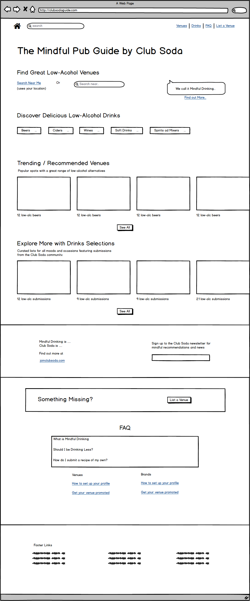

# Testing Review				

## Introduction
On Thursday 23d August 2018 we tested 5 individuals of varying competencies, bias, preferences, and awareness of Club Soda. Though the sample size was small, there were some standout points that affected most of the test subjects. Some of the information gathered at this session is of less immediate application, however. Some of the results suggest some fairly fundamental changes which would either alter deliverables or timelines to an unacceptable degree. 

The following insights can be saved (to corroborate and incorporate into later versions) and used or dismissed and discarded at Club Soda’s discretion. 

## Information Prerequisites
There was an information barrier to comfortable use of the site for a majority of users. Many people read the headline: “Find mindful drinks and good places to enjoy them” and were unable to discern its meaning and thus did not feel compelled to find either. It was described as “weird” and participants questioned the existence of a “mindful drink”. Others said that phrase meant nothing to them and was not explained, but the meaning might possibly be inferred from scrolling through the rest of the content on the home page. 

This barrier was something we discussed at our initial workshop - whether users of this site will know what “mindful drinking” is. We operated on the assumption that our users would all of them understand and so there is little mention (only one) of phrases like “no-alcohol”, “low-alcohol”, “alcohol-free”. Without an explicit mention of these phrases the inference was that these were alcoholic beers, wines, ciders, etc. 

## Clarity of Purpose
Several participants reacted with mildly reproachful confusion upon seeing the home page. One participant remarked: I’m not sure what I’m supposed to do. 

This was partly due to a tension between Venues and Drinks. With several users not reading the hero headline on first pass, it seemed to be interpreted as a strange mixture of products and venues to the effect that it wasn’t clear what the main purpose of the website was - “am I here to buy drinks or find places to drink them”. One participant, with whom I agree, suggested that one of these two features ought to be prioritised over the other. 

The UI above the fold was not clear enough in what it allowed users to do - one participant said, they might enter search terms like “non-alchoholic wines”, another remarked that there is only one mention of the phrase “no-alcohol” and that it’s not obvious at all that the offering is not alcoholic. 

Interestingly, many participants were soothed by the appearance of the FAQ section at the lower end of the page. Some suggested it would have saved them a lot of confusion (which in many real life situations equals abandonment) had they seen it earlier. 

## Discovery Model
Participants spoke of naturally discovering content (outside the context of the Club Soda Guide) in a variety of ways. Some search (some for recommendations, some for specific places and things) and some browse. When considering venues, most said they begin by considering locality unless something specific has been asked of them (like “a night out in West London”). Beyond this part, reviews and images of the venue itself were most important followed by drinks selection. When considering drinks, participants began with either clicking drinks in the navbar, searching for a specific category of drink, clicking a quick link beneath the fold or stumbling upon and clicking on a seemingly relevant “Selection”

When asked, **How do you normally find a place to go out?**, trends were as follows:
1. Discerning Model
- Search for “places to go out in London” / “top places” / “best places” (search for recommendations)
- Read recommendations, lists and reviews: comparing top-rated places
- Look at pictures of the venue on Social Media

2. Practical Model
- Use maps to find something near to me or search for a specific location
- Comparing based on images, social media images, reviews, and how to get there
- Use maps to figure out how to get there.

## Drinks Selections
As a piece of content for the “onboarded user” (the user who knows what the Club Soda guide is and who it's for), the drinks Selections (which act like curated “playlists” of drinks) were well received. Many participants found them confusing at first, but quickly understood what they were and felt they were useful for discovery. Again, the order of elements on the page meant that this realisation about Selections wasn’t always made until the user had got to the bottom of the page.

## General Aesthetics
The font families - especially the larger accent font received mixed reviews and may be over-used.

The hero image, footer image, and ‘newsletter/joinclubsoda’ image were criticised for their blandness, “randomness”, and colours.
	- One comment was that the imagery was too gendered and not inclusive enough of the minority of men in the Mindful Drinking movement.

The headline above the fold was not eye-catching or easy to read.

The UI components on the products were well received for their clarity and inviting appearance. 

The UI components for social hotspots were also complemented for their clarity and appeal. 

The Black-background and white text of the FAQ section was considered too harsh (or jarring) by some participants.

## Conclusions
#### Potential Quick Wins
- Update hero image to something more colourful / more self-explanatory, or remove the image altogether and replace with branded graphics, ui, and text. 
- Focus on phrases like “alcohol-free pub guide” with callouts saying things like: “we call it Mindful Drinking, find out more…”.
- Be more specific about products and venues being listed in the guide because they are low alcohol. 

#### Longer term Conclusions
It is always difficult and perhaps dangerous to make conclusions from small sample sizes. I think, in spite of the tiny sample, the home page that was tested did not solve the problem of ‘non-drinkers being unable to discover low-alcohol venues and products in an inclusive way’ and the reason for this is that the home page did not seem to be aimed at those people, but at a subset of private members.
At its core the Club Soda Guide is directory of venues, but this requires balancing with business objectives around brand promotion. I encourage the team to do more testing of this nature with a broad cross-section of individuals and to enact a plan for synthesising test results into the service design.

Attached below is a rough and ready potential update to the home page which incorporates a lot of the feedback from this testing session. Brand and product promotion is reserved for for venue pages and search results pages - a common advertisement pattern on other platforms. 

